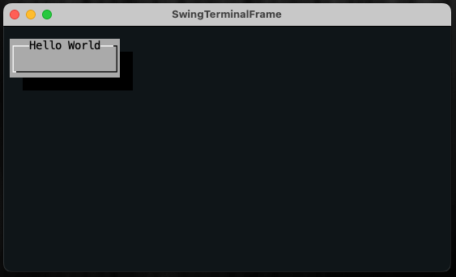

# starting lanterna
the following instructions will tell you the basic lines to add to your main.kt file in order to start working with lanterna

### imports
heres what my imports section looks like:
~~~
//imports
import com.googlecode.lanterna.TextColor
import com.googlecode.lanterna.graphics.SimpleTheme
import com.googlecode.lanterna.gui2.*
import com.googlecode.lanterna.gui2.dialogs.MessageDialog
import com.googlecode.lanterna.screen.Screen
import com.googlecode.lanterna.screen.TerminalScreen
import com.googlecode.lanterna.terminal.DefaultTerminalFactory
import com.googlecode.lanterna.terminal.Terminal
~~~
(note: this includes a lot of unnecessary imports not needed to just run a bare bones lanterna application)

### terminal and screen layers setup
in order to get the base application to open, you need to create a terminal and screen layers system. \
add these lines to the top of your main function:
~~~
val terminal: Terminal = DefaultTerminalFactory().createTerminal()
val screen: Screen = TerminalScreen(terminal)
screen.startScreen()

val textGUI: WindowBasedTextGUI = MultiWindowTextGUI(screen)
~~~
after adding these lines, a blank application should open on your desktop when running the main.kt file.

### creating and starting the GUI
in order to create and start a GUI, add this line the end of the main function
~~~
val gui = MultiWindowTextGUI(screen, DefaultWindowManager(), EmptySpace(TextColor.RGB(16, 22, 24)))
~~~

### adding a window
in order to display ui elements, we need to put them on a "window", in order to make a basic window, add the following to your code:
~~~
val window = BasicWindow()
window.title = "Hello World"
~~~
(note: make sure the above code is added above where you start the gui, the gui process should be at the end of your code) \
next, we need to add the window to the GUI we created earlier. at the very end of your main function, after you have created the gui, add this line:
~~~
gui.addWindowAndWait(window)
~~~
following the instructions above should yield the following result: \
 \
currently, our window has an ugly shadow behind it, and looks like its from a bygone era, gross.
windows can be customized to fit any need, more information on window customization and options 
can be found in the [windows](windows.md) file.

### adding a panel to our window
#### organization overview for clarity
In lanterna, panels are created before windows, and generally, smaller sub items are created before the larger items that they inhabit. 
a panel is a blank item that is similar to a div in html, adding a panel alone won't change the appearance of the output, but they are used to organize other components \
so far, including the creation of a panel, our code should be organized as such:
~~~
//setting up terminal and screen layers

//creating panel (child of window)

//creating window (child of gui)
//adding panel to window

//creating gui
//adding window to gui
//starting gui and waiting
~~~
excluding the terminal and screen layers setup: at the top of our code, we make the smallest items, and then we make the item that it is contained within,
and then we add our sub item to the containing item.
#### actually making the panel
so, with that established, the code for creating a basic panel should look like this:
~~~
val panel: Panel = Panel().setLayoutManager(BorderLayout())
~~~
but because a panel doesn't actually look like anything, lets add a label to it.
### adding a label to our panel
adding sub items to a panel is easy, after you have created the panel (but before you add it to the window)
just add a few lines to your code. \
we could add the label in one line of code to the panel, this is a good option for simple labels, or things that aren't going to be called multiple times
~~~
panel.addComponent(Label("label text goes here")
~~~
(note: in this case, we used "panel.addComponent", however, if we had previously named our panel something else, for example "playSpace", we would write "playSpace.addComponent") \
adding an item using one line works well in this situation, however, if we wanted to make something more complex, it might be best to first create our label, and then add it to the panel.
~~~
val labelName: Label = Label("label text goes here").setBackgroundColor(TextColor.RGB(22, 38, 46)).withBorder(Borders.doubleLine())
panel.addComponent(labelName)
~~~

