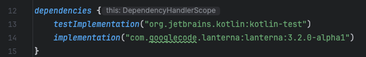

# getting started with lanterna in kotlin
the following instructions will tell you how to add the lanterna library to your kotlin project
## gradle setup
Firstly, add a line to your "build.gradle.kts" file
the line should read: 
~~~
implementation("com.googlecode.lanterna:lanterna:3.2.0-alpha1")
~~~
the line should be put in the "dependencies" section of the file. \
here is an example: \

